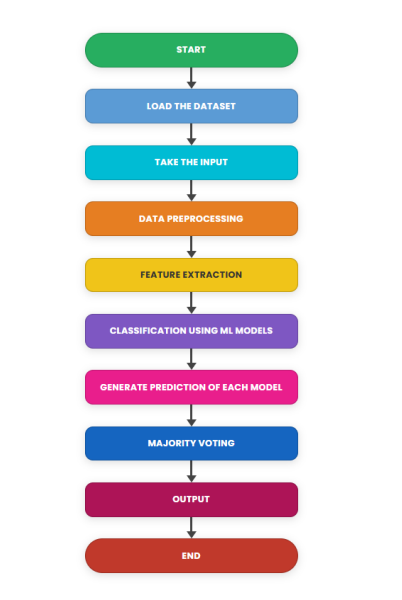
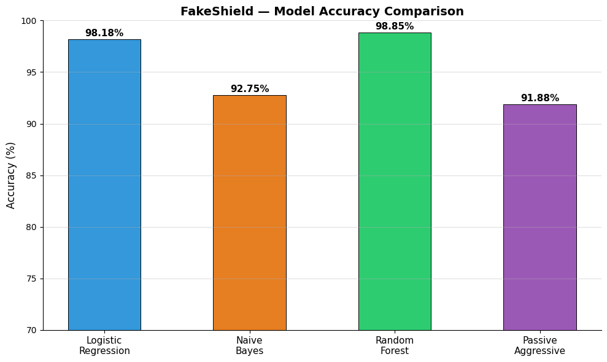
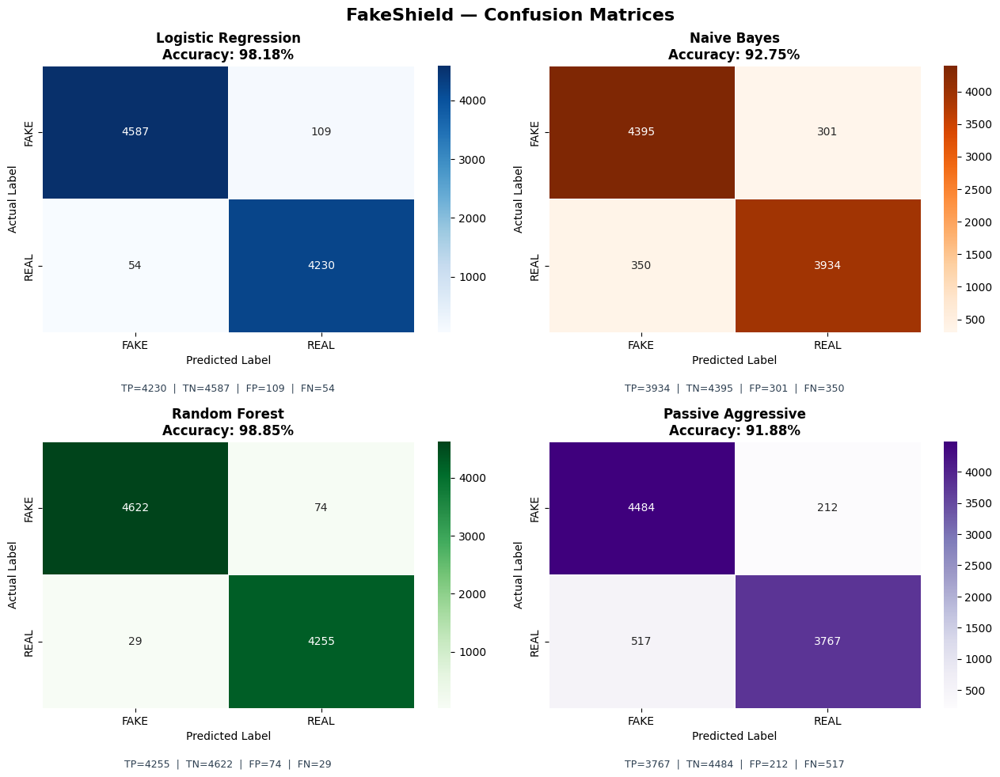
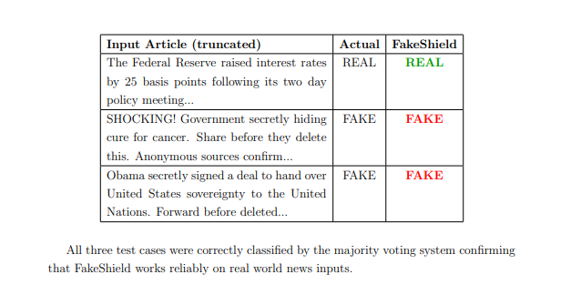

# 🛡️ FakeShield - Fake News Detection using Machine Learning


---

## 📖 Overview

FakeShield is a Machine Learning-based Fake News Detection system that classifies news articles as **Real** or **Fake** using Natural Language Processing (NLP).

The project performs data preprocessing, feature extraction using TF-IDF Vectorization, trains multiple machine learning models, evaluates their performance, and predicts whether a news article is genuine or fake.

---

## ✨ Features

- News text preprocessing
- Stopword removal
- Porter Stemming
- TF-IDF Vectorization
- Multiple Machine Learning models
- Accuracy comparison
- Classification reports
- Confusion matrix visualization
- Interactive prediction system

---

# 🧠 Machine Learning Pipeline

```
Dataset
    │
    ▼
Cleaning
    │
    ▼
Stopword Removal
    │
    ▼
Stemming
    │
    ▼
TF-IDF Vectorization
    │
    ▼
Model Training
    │
    ▼
Prediction
```

---

# 🤖 Models Used

- Logistic Regression
- Multinomial Naive Bayes
- Random Forest Classifier
- Passive Aggressive Classifier

---

# 📊 Evaluation Metrics

- Accuracy Score
- Classification Report
- Confusion Matrix

---

# 📂 Dataset

The project uses two datasets:

- Fake.csv
- True.csv

These datasets are merged and shuffled before preprocessing.

---

# 🛠️ Technologies Used

- Python
- Pandas
- NumPy
- Matplotlib
- Seaborn
- NLTK
- Scikit-learn
- Jupyter Notebook

---

# 📁 Project Structure

```
FakeShield-ML
│
├── dataset/
│   ├── Fake.csv
│   └── True.csv
│
├── notebook/
│   └── FakeShield.ipynb
│
├── models/
│
├── images/
│
├── README.md
├── requirements.txt
├── .gitignore
└── LICENSE
```

---

# 🚀 Installation

Clone the repository

```bash
git clone https://github.com/ayushpadhiary/FakeShield-ML.git
```

Go to the project directory

```bash
cd FakeShield-ML
```

Install the dependencies

```bash
pip install -r requirements.txt
```

Open the notebook and run all cells.

---

# 📸 Screenshots

# 🏗️ System Workflow

<p align="center">
  
</p>

---

# 📈 Model Accuracy Comparison

<p align="center">
  
</p>

---

# 📊 Confusion Matrices

<p align="center">
  
</p>

---

# 🔍 Sample Prediction

<p align="center">
  
</p>

# 🔮 Future Improvements

- Streamlit Web Application
- Flask REST API
- BERT Transformer Model
- Real-time News Detection
- Model Deployment
- Docker Support

---

# 👨‍💻 Author

**Ayush Padhiary**

GitHub: https://github.com/ayushpadhiary

---

# ⭐ If you like this project

Give this repository a ⭐ on GitHub.

---

# 📜 License

This project is licensed under the MIT License.
